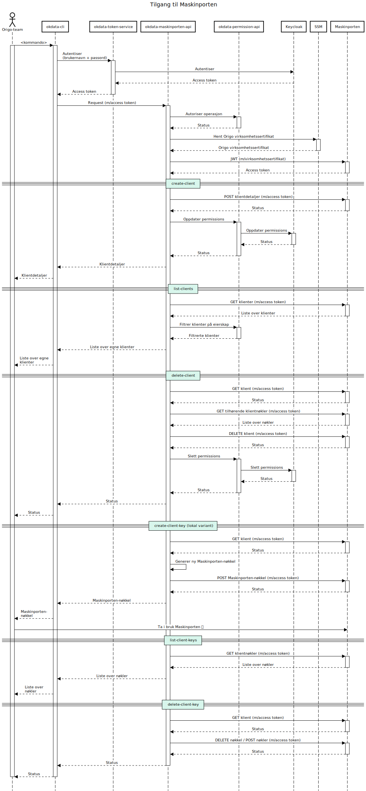

# Tilgang til Maskinporten for Origo-team

## Brukerflyt

Figuren nedenfor viser de forskjellige brukerflytene Origo-team har i
forbindelse med tilgang til Maskinporten. Hver komponent er beskrevet i større
detalj i [neste seksjon](#bestanddelene-i-løsningen).

Den øverste delen av diagrammet er felles for alle flytene, mens det som kommer
under skillelinjene (≡) er det som er spesifikt for hver flyt.

## Bestanddelene i løsningen

### `okdata-cli`

[`okdata-cli`](https://github.com/oslokommune/okdata-cli) er teamenes
grensesnitt mot løsningen. Gjennom et tekstbasert kommandolinjegrenesnitt kan
teamene selvbetjent administrere klienter og nøkler for tilgang til de ulike
registrene i Maskinporten.

`okdata-cli` kommuniserer med `okdata-maskinporten-api`, `okdata-permission-api`
og `okdata-token-service` gjennom AWS' API Gateway.

### `okdata-token-service`

[`okdata-token-service`](https://github.com/oslokommune/okdata-token-service) er
tjenesten som lar brukerne utveksle (AD) brukernavn og passord mot et access
token i Keycloak. Dette tokenet brukes deretter videre mot
`okdata-maskinporten-api` og `okdata-permission-api`.

### `okdata-maskinporten-api`

[`okdata-maskinporten-api`](https://github.com/oslokommune/okdata-maskinporten-api)
er tjenesten som snakker med Digdirs Maskinporten ved hjelp av Origos
virksomhetssertifikat.

Virksomhetssertifikatet ligger lagret i SSM, og denne tjenesten er den eneste
med lesetilgang dit. På den måten slipper vi at virksomhetssertifikatet spres
rundt på utviklermaskiner, og lar heller all kommunikasjonen gå gjennom
`okdata-maskinporten-api`.

#### Audit log

API-et loggfører hvem som gjør hva på hvilke ressurser i Maskinporten i en audit
log i DynamoDB, slik at man kan gå tilbake og se på historikken dersom det
skulle bli nødvendig.

[Point-in-time recovery](https://docs.aws.amazon.com/amazondynamodb/latest/developerguide/PointInTimeRecovery.html)
(PITR) er påslått for tabellen og muliggjør gjenopprettelse av tabelldataene til
et hvilket som helst tidspunkt siste 35 dager. I tillegg trigges en
[eksport](https://docs.aws.amazon.com/amazondynamodb/latest/developerguide/DataExport.html)
av tabellen til S3 én gang i måneden (se egen Lambda handler `jobs.backup.export_audit_trail`).

### `okdata-permission-api`

[`okdata-permission-api`](https://github.com/oslokommune/okdata-permission-api)
holder styr på hvem som har lov til å gjøre hva med ressursene
`okdata-maskinporten-api` opererer på i Maskinporten. Keycloak (driftet av UKE)
brukes som backend for tilgangsstyringen.
